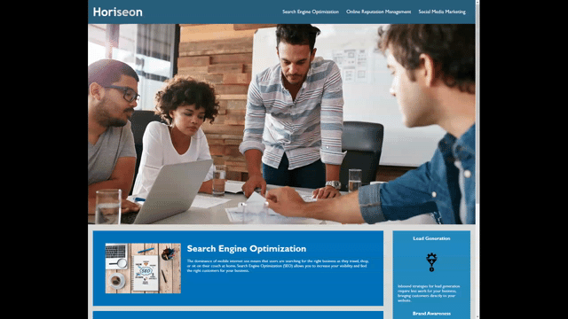

# Horiseon Code Refactor

## User Story

```md
AS A marketing agency
I WANT a codebase that follows accessibility standards
SO THAT our own site is optimized for search engines
```

## Description

```md
Increasing web accessibility and SEO through
Refactoring codebase by consolidating CSS code selectors and properties
Create semantic HTML elements
Create alt attributes for image elements
Elements follow logical structure
Describe code through comments
```

## Deployed URL

https://dmerk2.github.io/Horiseon_Code_Refactor/

## Video of Application

